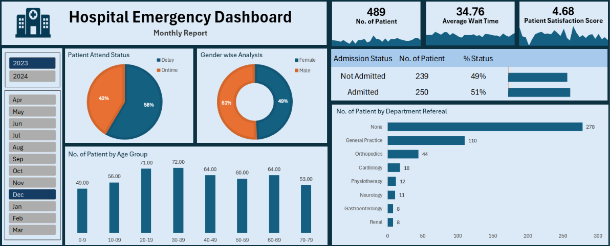

# Hospital Emergency Dashboard – Excel

## Project Overview

This project is an Excel dashboard created to analyze hospital emergency department data.

The dashboard provides a quick view of patient volume, admission status, waiting time, patient satisfaction, gender, age group and department referrals.

## Key Analysis

- Total number of patients
- Average patient wait time
- Patient satisfaction score
- Admission vs. non-admission
- Patient attendance status
- Gender-wise patient analysis
- Patient distribution by age group
- Department referral analysis

## Tools Used

- Microsoft Excel
- Pivot Tables
- Pivot Charts
- Excel Dashboard
- Slicers

## Dashboard

## Project Purpose

The main purpose of this project is to turn hospital emergency data into a simple dashboard that can help users understand patient trends and key operational metrics.

## Files

- `Hospital_Emergency_Dashboard.xlsx` – Excel dashboard
- `hospital-emergency-dashboard.png` – Dashboard preview